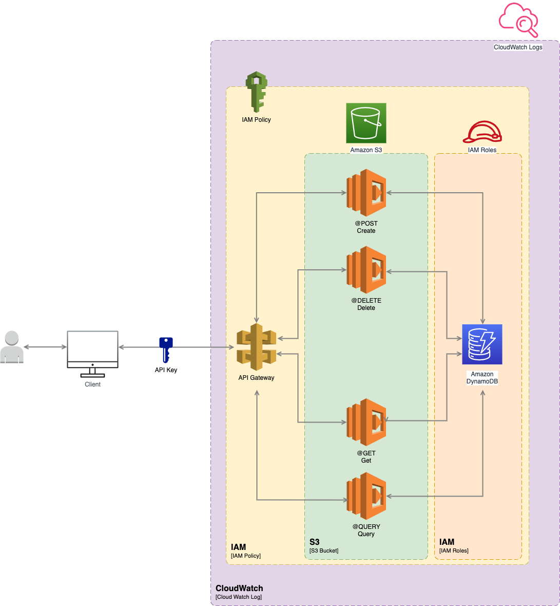

# Infrastructure as Code (IaC): Terraform and AWS Serverless

... is a way of managing your devices and servers through machine-readable definition files. Basically, you write down how you want your infrastructure to look like and what code should be run on that infrastructure. Then, with the push of a button you say “Deploy my infrastructure”. BAM, there is your application, running on a server, against a database, available through an API, ready to be used! And you just defined all of that infrastructure using IaC.

> IaC is a key practice of DEVOPS teams and integrates as part of the CI/CD pipeline.

A great Infrastructure as Code tool is Terraform by HashiCorp. (https://www.terraform.io/)
Personally I use it to provide and maintain infrastructure on AWS. And I’ve had a great experience doing that.

## Overview

I will demonstrate IaC by working out an example. 
We are going to set up an application on AWS. 
I provisioned the code on GitLab: https://github.com/microtema/serverless-terraform.git
A user can enter a coding tip and see all the coding tips that other users have entered. 
The tips are stored in a NoSQL database which is AWS DynamoDB. 
Storing and retrieving these tips is done by the Lambda Functions which fetch or put the tips from and to the database. For the application to be useful, users have to be able to call these Lambda Functions. So we expose the Lambda Functions through AWS API Gateway. 

Here is an architectural overview of the application:

### API Gateway

API Gateway is a fully managed service provided by AWS that makes it easy for developers to create, publish, and manage APIs for their applications. The service acts as a "front door" for applications, providing a secure and scalable interface for clients to access backend resources and services.

API Gateway supports a wide range of API types, including REST APIs and WebSocket APIs, and provides a variety of features and functionality, such as:

* API Creation and Configuration: Developers can use the API Gateway console, CLI, or APIs to create and configure APIs, including endpoints, methods, authentication, and other settings.

* API Deployment and Management: APIs can be deployed to multiple stages, such as development, staging, and production, allowing developers to easily manage versioning, testing, and release cycles. The service also provides detailed monitoring and logging capabilities to help developers diagnose issues and optimize performance.

* Security and Authentication: API Gateway supports a variety of authentication methods, including AWS Identity and Access Management (IAM), Lambda authorizers, and custom authorizers, allowing developers to control access to their APIs and resources.

* Scaling and Performance: API Gateway can automatically scale to handle large volumes of traffic and can integrate with other AWS services, such as Amazon EC2, AWS Lambda, and AWS Elastic Beanstalk, to provide additional compute resources and improve performance.

* Integration with Other AWS Services: API Gateway can be used to integrate with other AWS services, such as AWS Lambda, AWS Step Functions, and Amazon S3, to create powerful and flexible applications and workflows.

Overall, API Gateway provides a powerful and flexible platform for building modern, scalable, and secure APIs that can be easily integrated into any application or workflow.

### AWS Lambda

AWS Lambda is a serverless computing platform provided by Amazon Web Services (AWS) that enables developers to run code without having to provision or manage servers. With AWS Lambda, developers can simply upload their code to the service and it will automatically scale and run the code in response to requests or events, without needing to worry about infrastructure or resource management.

AWS Lambda supports a wide range of programming languages, including Node.js, Python, Java, C#, Go, and Ruby, and can be used to build a variety of applications and services, such as APIs, web applications, and backend services. The platform provides a variety of features and functionality, including:

* Flexible and Scalable: AWS Lambda can automatically scale to handle large volumes of traffic and can be used to build highly available and fault-tolerant applications. The platform also provides a variety of configuration options, such as memory and timeout settings, to optimize performance and cost.

* Event-Driven Computing: AWS Lambda can be used to build event-driven applications that respond to events, such as changes to data in Amazon S3 or updates to a database, in real-time. The platform provides a variety of event sources, such as AWS SNS, AWS SQS, and AWS Kinesis, to trigger the execution of Lambda functions.

* Integration with Other AWS Services: AWS Lambda can be integrated with other AWS services, such as Amazon S3, Amazon DynamoDB, and Amazon API Gateway, to build complex and powerful applications and workflows.

* Security and Authentication: AWS Lambda provides a variety of security features, such as encryption at rest and in transit, and can be integrated with other AWS services, such as AWS Identity and Access Management (IAM), to control access to resources and services.

Overall, AWS Lambda provides a powerful and flexible platform for building serverless applications and services that are highly scalable, cost-effective, and easy to manage.

### IAM Policy

IAM (Identity and Access Management) policies are a set of rules that define the permissions granted to a specific user, group, or role in an AWS account. IAM policies are used to control access to AWS services and resources, and can be used to enforce security policies, regulatory compliance, and other governance requirements.

An IAM policy is a JSON document that consists of a set of statements, each of which defines a specific permission or set of permissions. Each statement includes an action, which defines the operation being performed (such as "ec2:StartInstance" or "s3:ListBucket"), a resource, which defines the AWS resource that the action is being performed on (such as an Amazon S3 bucket or an EC2 instance), and a set of conditions, which can be used to further restrict access.

IAM policies can be attached to individual users, groups, or roles, and can be inherited or overridden by other policies. IAM policies can also be used in combination with AWS Organizations to manage access to multiple AWS accounts from a central location.

IAM policies can be created and managed using the AWS Management Console, the AWS CLI, or programmatically using the AWS SDKs. IAM policies are a powerful tool for managing access to AWS resources and services, and are an essential component of any security and compliance strategy on the AWS platform.

### IAM Roles

IAM (Identity and Access Management) roles are a secure way to grant permissions to entities in AWS, such as AWS services, users, and groups. IAM roles are used to grant temporary permissions to entities, rather than providing permanent access keys, which can enhance security and reduce the risk of unauthorized access.

IAM roles can be created and assigned to AWS resources, such as EC2 instances, AWS Lambda functions, and Amazon RDS instances, to provide these resources with access to other AWS services or resources. For example, an EC2 instance can be assigned an IAM role that allows it to read and write to an S3 bucket, without requiring any additional authentication or access keys.

IAM roles have a set of policies attached to them that define the permissions granted to the role. These policies can be created and managed in a similar way to IAM policies. IAM roles can also have trust relationships defined for them, which specify which entities are allowed to assume the role.

One of the key benefits of using IAM roles is that they can be assumed by any entity that is authorized to do so. For example, an EC2 instance can assume an IAM role assigned to it, or a user can assume a role assigned to them using the AWS Management Console, the AWS CLI, or programmatically using the AWS SDKs.

Overall, IAM roles provide a flexible and secure way to manage access to AWS resources and services, and are an essential component of any security and compliance strategy on the AWS platform.

### Amazon DynamoDB

Amazon DynamoDB is a fully managed NoSQL database service provided by Amazon Web Services (AWS). DynamoDB is designed to provide fast and predictable performance at any scale, with low latency and high throughput for both read and write operations. DynamoDB is used by organizations of all sizes for a wide range of use cases, including web and mobile applications, gaming, ad tech, IoT, and more.

DynamoDB is a key-value and document database that stores data in tables, where each table consists of items and attributes. Items are similar to rows in a traditional relational database, and attributes are similar to columns. However, unlike traditional databases, DynamoDB does not enforce a fixed schema, and items in a table can have different attributes. This allows for more flexibility in data modeling, and can simplify development and maintenance of applications.

DynamoDB supports a variety of features, including:

* Fully managed: DynamoDB is a fully managed service that automates database administration tasks, such as hardware provisioning, software patching, and backups. This allows developers to focus on building applications, rather than managing infrastructure.

* Highly scalable: DynamoDB can scale to handle millions of requests per second, with automatic partitioning and load balancing. This makes DynamoDB well-suited for applications with unpredictable or rapidly changing workloads.

* Low latency and high throughput: DynamoDB provides predictable performance, with low latency and high throughput for both read and write operations. This allows applications to scale seamlessly without sacrificing performance.

* ACID transactions: DynamoDB supports ACID transactions for individual items or groups of items, providing strong consistency for critical data.

* Global tables: DynamoDB supports global tables, which enable multi-region, multi-master deployments for low-latency global access to data.

DynamoDB can be accessed using a variety of APIs and SDKs, including the AWS Management Console, the AWS CLI, and the AWS SDKs for popular programming languages such as Node.js, Python, Java, and more. Overall, DynamoDB provides a powerful and flexible NoSQL database service that is well-suited for a wide range of applications and use cases.

### CloudWatch

Amazon CloudWatch is a monitoring and observability service provided by Amazon Web Services (AWS). CloudWatch allows users to collect, monitor, and analyze metrics, logs, and events from a wide variety of AWS resources, services, and custom applications. CloudWatch provides real-time visibility into application and infrastructure performance, and helps users detect and diagnose issues quickly.

CloudWatch supports a wide range of features, including:

* Metrics: CloudWatch allows users to collect and monitor metrics from AWS resources, such as EC2 instances, RDS databases, Lambda functions, and more. Users can also publish custom metrics to CloudWatch using the CloudWatch API or SDKs. CloudWatch provides pre-built dashboards and alarms to help users visualize and alert on metrics.

* Logs: CloudWatch allows users to collect, monitor, and analyze logs from AWS resources, such as EC2 instances, ECS containers, and Lambda functions. Users can also publish custom logs to CloudWatch using the CloudWatch API or SDKs. CloudWatch provides advanced search and analytics capabilities, and supports integration with popular third-party log management tools.

* Events: CloudWatch allows users to monitor and respond to events from AWS resources, such as EC2 Auto Scaling, S3, and Lambda. Users can create rules that trigger automated actions, such as scaling or notifications, based on specific events.

* Alarms: CloudWatch allows users to set up alarms based on metrics or events, and receive notifications when thresholds are breached. Alarms can be used to trigger automated actions, such as scaling or recovery, in response to specific conditions.

* Dashboards: CloudWatch provides customizable dashboards that allow users to visualize and monitor metrics and logs in real-time.

CloudWatch can be accessed using a variety of APIs and SDKs, including the AWS Management Console, the AWS CLI, and the AWS SDKs for popular programming languages such as Node.js, Python, Java, and more. CloudWatch provides a powerful and flexible monitoring and observability service that is essential for operating and maintaining modern cloud applications and infrastructure.